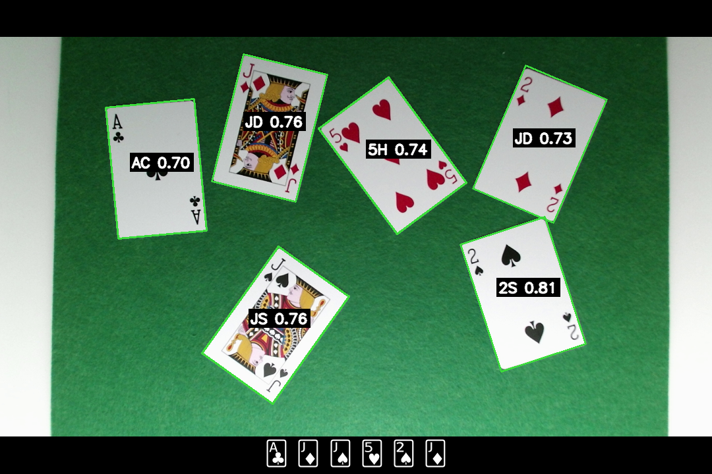
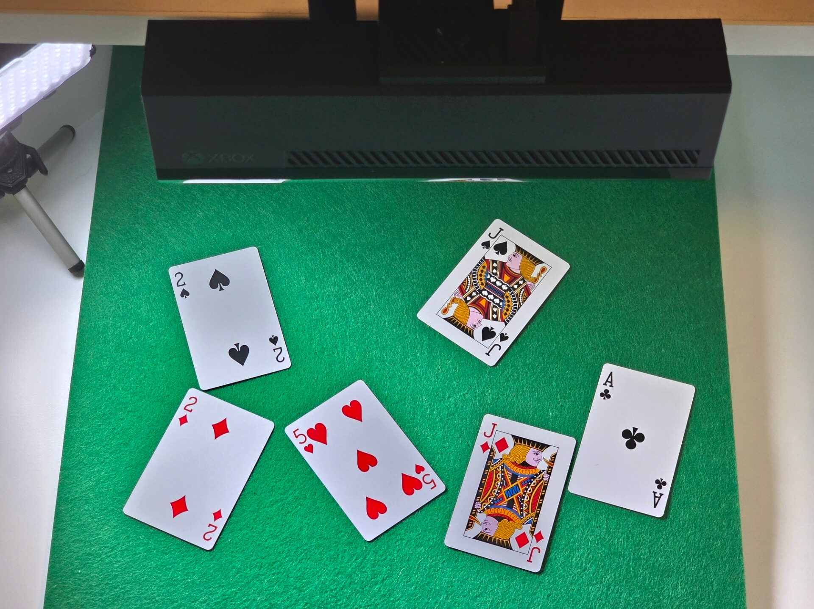
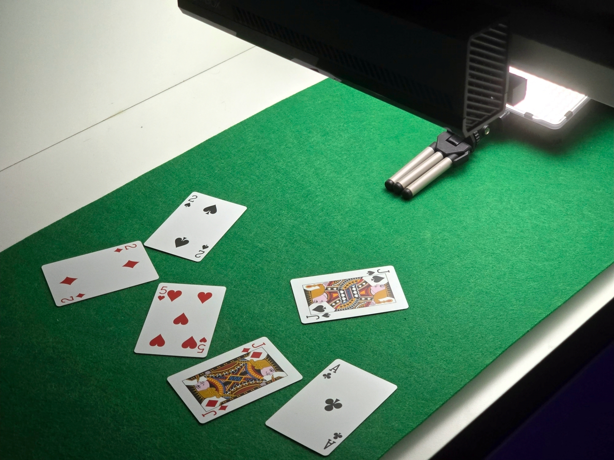

= Sistema de Reconocimiento de Cartas de Póker - Examen Parcial

Este proyecto implementa un sistema de Visión Artificial capaz de detectar, identificar y clasificar cartas de la baraja francesa sobre un tapete verde en tiempo real. El sistema está diseñado para identificar y corregir rotaciones, oclusiones parciales y condiciones de iluminación variables.

---

---

== Instalación y Uso

1. *Clonar repositorio:*
+
[source,bash]
----
git clone https://github.com/0xJVR/25-26-IYA051-Inteligencia-Artificial.git
cd "25-26-IYA051-Inteligencia-Artificial/retos_examenes/examen parcial/reconocimiento-cartas"
----

2. *Environment y dependencias:*
+
[source,bash]
----
python3 -m venv venv
source venv/bin/activate
pip install -r requirements.txt
----

3. *Ajustes avanzados*
En caso de necesitar realizar algún ajuste avanzado, como entrada de video, tamaño de cartas, posición de los números y palos, color del tapete, umbral del nivel de detección o cantidad de hilos de CPU a usar, se pueden ajustar en el archivo `config.json`.

4. *Generar Plantillas (Solo primera vez):*
  * Ejecutar `python main.py`.
  * Pulsar tecla `T` para entrar al "Template Builder".
  * Seguir instrucciones en pantalla para capturar Rank (A-K) y Suits (Palos).

5. *Ejecutar:*
+
[source,bash]
----
python main.py
----

6. *Controles:*
  * `Q`: Salir.
  * `G`: Activar/Desactivar mascara de fondo verde (Tapete).
  * `Z`: Activar/Desactivar ventanas de depuración por carta individual.
  * `S`: Guardar captura de pantalla.

---

== 1. Hardware

=== Características Técnicas

* *Dispositivo de Captura:* Microsoft Kinect One (1920x1080 FHD)
* *Foco de luz:* Foco LED para iluminación difuminada.

=== Justificación de Uso

Se ha seleccionado el sensor *Kinect One* frente a webcams convencionales por las siguientes razones:

1. *Óptica de Gran Angular:* Permite abarcar una mesa de juego completa sin necesidad de situar la cámara a una altura excesiva.
2. *Mínima distorsión de lente:* La lente cuenta con una distorsión inferior al 1% en sus laterales, manteniendo una correcta relación de imagen.
3. *Estabilidad de Imagen:* El sensor es capaz de obtener buenas imágenes en condiciones de baja luminosidad.

== 2. Software

=== Características Técnicas

* *Librerías Python:*
  * *OpenCV:* Obtención y procesamiento de imagen.
  * *NumPy:* Operaciones matriciales.
  * *Pillow:* Renderizado de iconos Unicode de cartas en el overlay.

* *Drivers:*
  * Se usa el driver `libfreenect2` compilado manualmente para poder realizar aceleración por hardware en el procesado de la imagen, aprovechando el hardware del Kinect.

=== Justificación de Uso

Se utiliza OpenCV para facilitar el procesado de la imagen; además, sus llamadas se ejecutan en C++, permitiendo un rendimiento óptimo. La arquitectura se ha modularizado en múltiples archivos con sus respectivas responsabilidades para separar la lógica matemática, el procesamiento de imagen y la lógica de negocio.

---

== 3. Hoja de Ruta del Desarrollo

El desarrollo se ha llevado a cabo en fases iterativas:

1. *Preparación:* Configuración de la cámara y compilación de los drivers. Adicionalmente, se ha diseñado y creado un soporte impreso en 3D para fijar la cámara en un plano cenital y mantener consistencia visual.
2. *Enmascarado de fondo:* Separación del fondo verde de las cartas mediante rangos HSV.
3. *Geometría:* Detección de contornos y aproximación poligonal para hallar cuadriláteros, además de la transformación de perspectiva para obtener una vista frontal de cada carta.
4. *Reconocimiento:* Creación del sistema de plantillas para obtener una imagen nítida de cada símbolo en la esquina de la carta. Se utiliza NCC (Normalized Cross-Correlation).
5. *Refinamiento:* Implementación de heurísticas por color para reducir confusión entre palos, reduciendo un 50% la probabilidad de error.

---

== 4. Solución: Lógica de Decisión

El siguiente diagrama explica cómo el sistema decide qué carta está viendo una vez se ha aislado un posible candidato rectangular.

1. *Entrada:* Recorte de la carta rectificado.
2. *ROI:* Extracción de esquinas (Top-Left y Bottom-Right).
3. *Binarización:* Conversión a blanco y negro puro.
4. *Matching (Rango y Palo):* Comparación con plantillas.
5. *Verificación de Color:* Si el matching indica "Corazones" pero la imagen no presenta píxeles rojos, se reevalúa entre palos negros.
6. *Salida:* Identidad de la carta y nivel de confianza.

---

== 5. Secuencialización de Operaciones sobre las Imágenes

A continuación se detalla el *pipeline* de procesamiento de imagen.

=== Paso 1: Segmentación por Color (HSV)

*Función:* `core.py -> non_green_mask()`

* *Operación:* Conversión BGR -> HSV.
* *Configuración:* `green_hsv_low: [35, 40, 40]` a `green_hsv_high: [85, 255, 255]`.
* *Justificación:* HSV separa color de iluminación, facilitando segmentar el tapete verde.

=== Paso 2: Limpieza Morfológica

*Función:* `core.py -> non_green_mask()`

* *Operación:* `MorphologyEx` (OPEN y CLOSE).
* *Configuración:* Kernel elíptico 5×5.
* *Justificación:*
  * *Open:* Elimina ruido.
  * *Close:* Cierra agujeros internos provocados por brillos.

=== Paso 3: Separación de Objetos (Watershed)

*Función:* `core.py -> watershed_segments()`

* *Operación:* Transformada de distancia + algoritmo Watershed.
* *Configuración:* `watershed_distance_rel: 0.35`.
* *Justificación:* Permite separar cartas que se tocan, evitando que sean detectadas como un único contorno.

=== Paso 4: Detección y Filtrado de Contornos

*Función:* `core.py -> find_card_quads()`

* *Operación:* Canny -> `findContours` -> `minAreaRect`.
* *Configuración:*
  * Área mínima: `min_contour_area: 1000`
  * Relación de aspecto permitida: `card_ar_range: [1.15, 1.65]`
* *Justificación:* Filtrar únicamente cuadriláteros compatibles con cartas.

=== Paso 5: Corrección de Perspectiva (Warping)

*Función:* `core.py -> warp_card()`

* *Operación:* `getPerspectiveTransform` + `warpPerspective`.
* *Configuración:* `canonical_width: 400`.
* *Justificación:* Estabiliza la entrada para el reconocedor alineando todas las cartas a 400×600 px.

=== Paso 6: Extracción de ROI (Región de Interés)

*Función:* `recognition.py -> roi_from_frac()`

* *Operación:* Recorte mediante *slicing*.
* *Configuración:* `tl: [0.02, 0.05, 0.16, 0.26]`.
* *Justificación:* Solo se necesitan las esquinas donde están rango y palo, reduciendo ruido y tiempo de proceso.

=== Paso 7: Matching y Verificación Espectral

*Función:* `recognition.py -> recognize_card_from_rois()`

* *Operación:* `matchTemplate` (NCC) + análisis de histograma de color.
* *Justificación:*
  1. Matching de ROI contra plantillas (A, 2, K, Picas, Corazones...).
  2. *Heurística de Color:* Si el matching detecta un palo negro pero hay >3% de píxeles rojos, se fuerza búsqueda en palos rojos, reduciendo el error al 50%.

